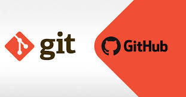
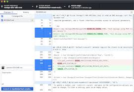

# Git. Github

No GitHub, gerentes e desenvolvedores de projetos coordenam, controlam e atualizam seu trabalho em um único local, para que os projetos permaneçam transparentes e dentro do cronograma.

O GitHub é uma plataforma de desenvolvimento inspirada na maneira como você trabalha. Do código aberto aos negócios, você pode hospedar e revisar códigos, gerenciar projetos e criar software junto a 40 milhões de desenvolvedores. Eu

 ![Image](./64c71002d999772c40293a46e4f2cc08.jpg

O Github tem sim muita relação com o Git. GitHub é uma plataforma para gerenciar seu código e criar um ambiente de colaboração entre devs, utilizando o Git como sistema de controle. Ele vai facilitar o uso do Git, escondendo alguns detalhes mais complicados de setup. É lá que você provavelmente vai ter seu repositório e usar no dia a dia.

 

O sistema web que ele possui permite que você altere arquivos lá mesmo, apesar de não ser muito aconselhado, pois você não terá um editor, um ambiente de desenvolvimento e testes. Para se comunicar com o github e mexer nos arquivos do seu reposítorio, você pode usar a linha de comando, usando o comando do git e suas diretivas de commit, pull e push. Parece assustador? Há uma alternativa: usar um aplicativo desktop mais intuitivo:

O Github Desktop é uma casca para o comando do git, que esconde alguns termos que podem ser assustadores para quem está começando. Eu indico fortemente seu uso como primeiro passo, pois o sistema inteiro dá uma cara de "sincronizador de código". Facilita a visualizações, o envio e recebimento das modificações e os famosos conflitos de merge, que você não precisa se preocupar nesse primeiro instante.

Imagine que, há alguns meses, você desenvolveu um site que possuia determinada função. 

Com o passar do tempo, essa função perdeu sua utilidade e você foi instruído a retirá-la do código fonte deste site.

Após seis meses, por uma questão de estratégia de negócio, essa função deve ser novamente implementada.

Para programadores(as) que utilizam o GIT, reincluir a funcionalidade é uma tarefa simples: basta buscar, em seu repositório, a versão que a contempla e retomá-la.

Para aqueles(as) que não utilizam, talvez seja necessário reescrever o código desta função, consumindo novamente o tempo gasto para desenvolvê-la da primeira vez.

Diante desta situação, podemos concluir que uma das maiores vantagens de usar o GIT é a economia de tempo e recursos, uma vez que a consulta de diferentes versões de uma mesma aplicação é muito recorrente no trabalho do(a) programador(a).

Outro grande benefício do GIT é justamente o fato de ele ser um sistema distribuído.

Isso significa que, diferentemente de outros sistemas de controle de versionamento populares na época em que foi lançado, o GIT possui repositórios, e não somente um único local com o histórico de seu trabalho.

Para auxiliar o trabalho em equipe, recursos como o fluxo de desenvolvimento do Gitflow também trazem muitos benefícios, inclusive porque pode ser acessado por qualquer membro do time em qualquer lugar.
