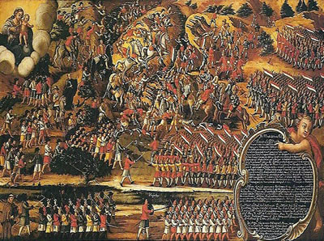

# Trabalho de história

# Pesquisa : batalha dos Guararapei 

# prof : Diego

# Aluno : Kauã Adriann

# Classe : 8 ano B

"As Batalhas dos Guararapes foram as principais ações bélicas ocorridas no Nordeste brasileiro contra a presença dos holandeses na região. Deflagradas em abril de 1648 e fevereiro de 1649, as batalhas enfraqueceram as posições holandeses na colônia portuguesa, o que culminou com a saída dos flamengos em 1654.

Além disso, as Batalhas dos Guararapes trouxeram dois novos elementos para a história brasileira: no aspecto militar, o aparecimento das táticas de guerrilha; no aspecto social, a atuação conjunta entre europeus, africanos e indígenas contra um inimigo externo.

As duas Batalhas dos Guararapes ocorreram no contexto da ocupação holandesa no Nordeste da colônia portuguesa nas Américas. A ocupação holandesa de territórios portugueses ocorreu quando o Reino de Portugal passou a ser administrado pelo Reino da Espanha, após a morte de dom Sebastião, em 1580. Os Países Baixos, dos quais a Holanda era a principal província, também eram possessão espanhola e estavam em guerra para conseguir a independência em relação à dominação ibérica.

Uma forma adotada pelos holandeses para atacar os espanhóis foi ocupar as colônias portuguesas. Para isso, a Holanda criou duas empresas de atuação internacional, as Companhias das Índias Ocidentais e Orientais. A primeira ficou responsável pela ocupação do Nordeste brasileiro, ação que se iniciou em 1624, na Bahia. Mas a permanência holandesa nesse local durou apenas um ano, já que foram expulsos em 1625."

Veja mais sobre "Batalhas dos Guararapes (1648-1649)" em: https://brasilescola.uol.com.br/guerras/batalhas-dos-guararapes-1648-1649.htm

 

"Porém, em 1630, os holandeses conseguiram ocupar a capitania de Pernambuco, estendendo ao longo dos anos seu domínio da foz do Rio São Francisco (em Alagoas e Sergipe) até o Ceará. O objetivo dos holandeses era explorar a produção do açúcar na região, complementando o trabalho de refino do produto que já exerciam anteriormente.

A relação entre os colonos portugueses e os holandeses ficou deteriorada após a intensificação da cobrança de impostos e das dívidas contraídas pelos senhores de engenho com a Companhia das Índias Ocidentais. Frente a isso, os habitantes de origem portuguesa decidiram lutar pela expulsão dos holandeses, principalmente pela falta de apoio da metrópole portuguesa nessa empreitada.

As principais batalhas de enfrentamento aos holandeses ocorreram no Morro dos Guararapes, onde hoje se localiza Jaboatão dos Guararapes, cidade da Grande Recife. A ação contra os holandeses contou com a união das três etnias que compõem a população brasileira: europeus, africanos e indígenas.

Os portugueses nascidos no Brasil eram conhecidos como mazombos e foram liderados nas batalhas por Antônio Dias Cardoso. Cardoso adotou como estratégia de combate as ações guerrilheiras, já que seus homens estavam em menor número e com armamento inferior ao dos holandeses. O objetivo era aproveitar o conhecimento do terreno da região para criar emboscadas aos holandeses e assim superar as deficiências de armamentos e de contingente. Dessa forma, os combates poderiam se dar corpo a corpo, anulando o poderio bélico holandês.

As batalhas deram-se no momento em que os holandeses tentaram atacar os portugueses por terra, dirigindo-se ao sul do Recife, onde ficava o morro dos Guararapes. Para enfrentá-los, Dias Cardoso contou ainda com o apoio de indígenas comandados pelo índio potiguar convertido ao catolicismo, Felipe Camarão, bem como por uma força de africanos comandados pelo escravo liberto Henrique Dias.

O terreno formado por mangues e estradas estreitas foi crucial para a vitória das tropas luso-portuguesas. Mesmo com o aporte holandês após os primeiros reveses, os 4000 a 6000 homens comandados pelos flamengos não foram páreos para os 2500 comandados pelos luso-brasileiros. Os saldos dos conflitos foram de 500 baixas e 500 feridos entre os holandeses, e 80 mortes e 400 feridos entre os comandados dos mazombos. Apesar de ocorrer a última batalha em 1649, os holandeses somente saíram do Nordeste em 1654.

Dentro da historiografia brasileira há a afirmação de que o motivo da vitória sobre os holandeses não foi apenas de ordem econômica, já que o sentimento religioso dos católicos portugueses contra os judeus e protestantes holandeses era um poderoso estímulo para o combate.

Além disso, no processo histórico de constituição da identidade nacional, as Batalhas de Guararapes serviram como marco inicial do que seria o povo brasileiro. A ação conjunta de europeus, africanos e indígenas daria o tom do que viria a ser no futuro o brasileiro. No período, as forças que combateram os holandeses eram conhecidas como patriotas, apontando o início da criação dessa identidade nacional."

Veja mais sobre "Batalhas dos Guararapes (1648-1649)" em: https://brasilescola.uol.com.br/guerras/batalhas-dos-guararapes-1648-1649.htm
